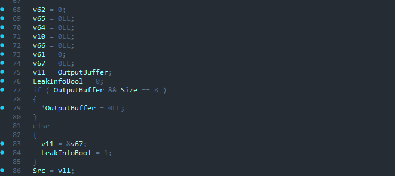
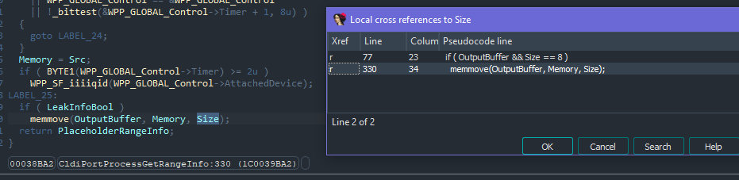
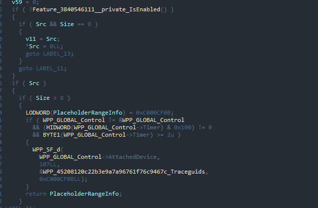
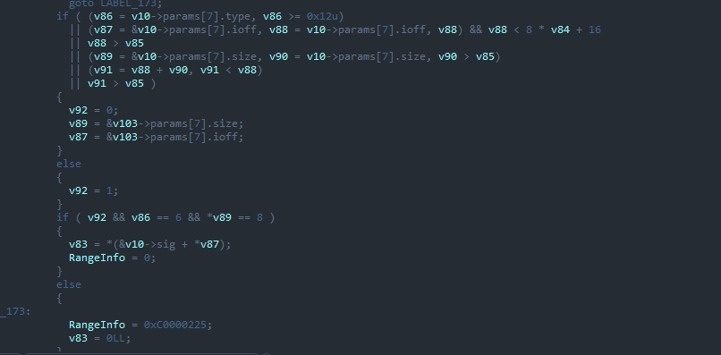
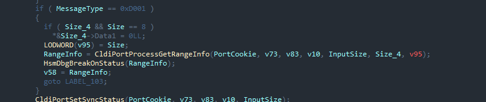
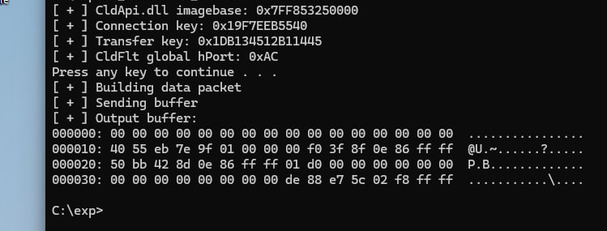

# CVE-2024-26160 (cldflt.sys information disclosure vulnerability)

There's small writeup about **CVE-2024-26160**, what can be found in the February patch (**KB5034765**, Windows 11 22H2, Windows 11 23H2). The vulnerability has been closed in the March patch (**KB5035853**).

## Analysis

The vulnerability is located in the `CldiPortProcessGetRangeInfo` function, it does **not** check for the buffer size passed from the user application. Since the size can be controlled by the user, `memmove`, which copies the returned information, can grab a neighboring memory pool that contains kernel addresses if the size is correctly passed.

The March patch (**KB5035853**) introduces an additional check for buffer size.

Under normal conditions, the vulnerable function is called when the `CfGetPlaceholderRangeInfoForHydration` function is called, it contains a fixed size for the returned buffer, so it is necessary to construct a data packet that will reach the vulnerable function call. The call of the required function passes through the `CldiPortNotifyMessage` function, where all packets, including some specific ones, must be validated.

It is important to pass the message type in order to trigger the leak.

If the data packet is properly formed, we will see address leakage.

